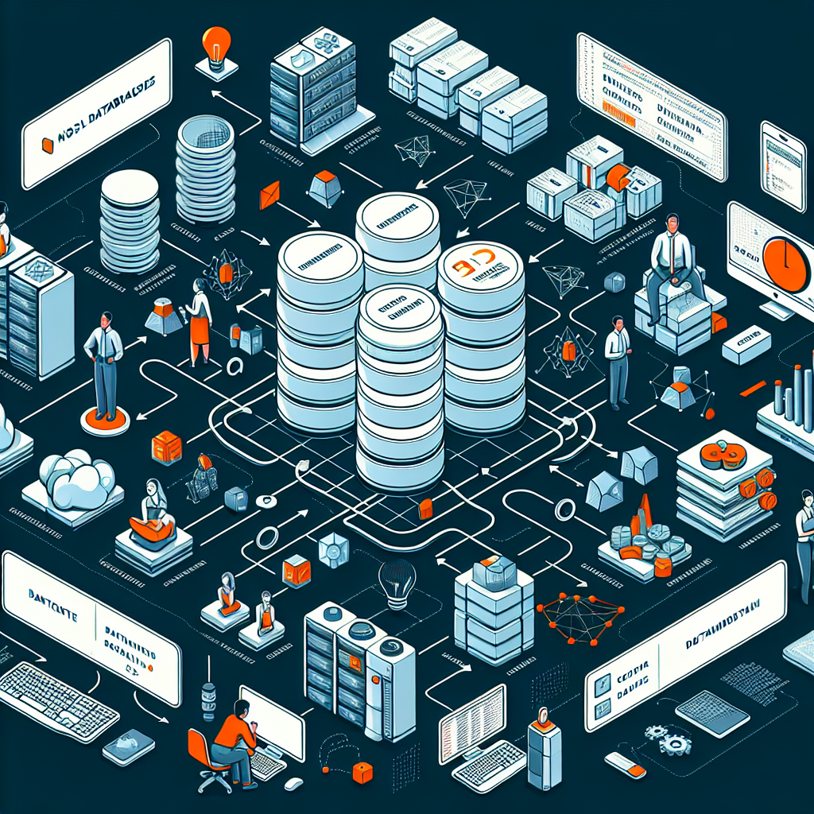

# 0x01-NoSQL

<h2>
NoSQL: The Future of Data Management
  </h2>
  

  NoSQL, or "not only SQL," is a database management system that offers a flexible and scalable approach to storing and retrieving data.
Unlike traditional relational databases, NoSQL databases are schema-less, allowing for dynamic and unstructured data storage.
NoSQL databases excel in handling large volumes of data, making them ideal for applications that require high scalability and performance.
With its distributed architecture, NoSQL provides fault tolerance and high availability, ensuring uninterrupted access to data even in the face of failures.
NoSQL databases, such as MongoDB and Cassandra, have gained popularity in modern applications, enabling developers to build robust and scalable systems.

