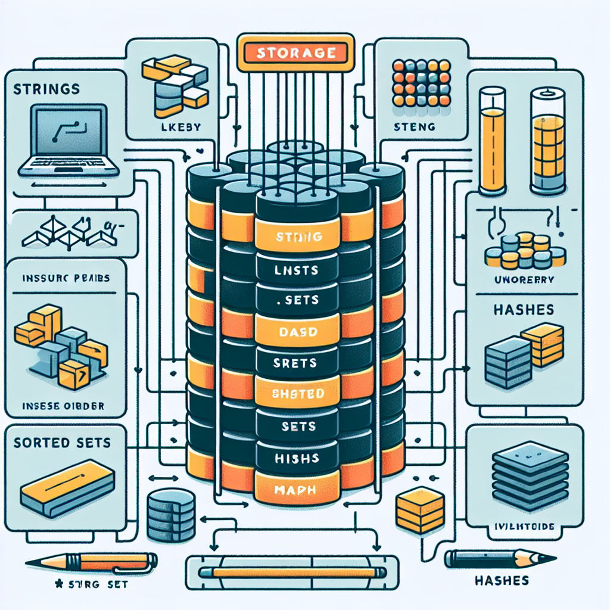

# 0x02-redis_basic

 Redis_Basic is a game-changing database tool. With its lightning-fast performance and flexible data structures, Redis_Basic empowers developers to optimize their applications. From caching to pub/sub messaging, Redis_Basic excels in various use cases. Say goodbye to complex setups and hello to simplicity with Redis_Basic. Experience the magic of Redis_Basic and unlock new possibilities for your projects. Get ready to supercharge your development process with Redis_Basic's efficiency and versatility. 

